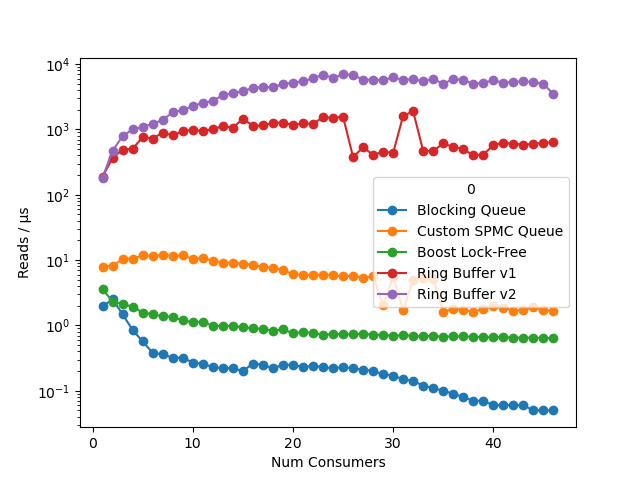

# Benchmarking Single Producer Multiple Consumer (SPMC) queues

The purpose of the repository is to compare the throughput of implementations of
SPMC queues. Let's meet the contenders:

- Blocking queue (std::mutex, std::unique_lock)
- Custom SPMC lock-free queue
- Boost lock-free queue
- SPMC wait free ring buffer (v1)
- SPMC wait free ring buffer (v2)

## Results
I ran the measurements on Intel XEON Gold 5418Y and my Apple M2; the results are summarized below.
There is an important note on interpreting the results.
The Blocking Queue, SPMC queues, and the Boost lock-free queue are "true" queues compared to the ring buffers.
For queues, if a queue element is read by a consumer, it becomes invisible to other consumers. 
In the implementation of ring buffers, every consumer reads the same data after the producer posted it.
Therefore, the number of reads for the ring buffers is divided by the number of consumers tohave the comparison fair.

These are the results of my benchmark measured on Intel Xeon Gold 5418Y.

This figure summarizes the measurement on my Mac M2.

## Build Instructions
I didn't want to bother with CMake this time, so you'll have to tweak the  and the cache line size in .
There is a comparison with Boost so it should be present and pointed to in the  in order to compile.

## Please please please I want to plot the results too
Run the benchmark and paste the output (the summary section) into .

## References
Inspired by
 and 
.
